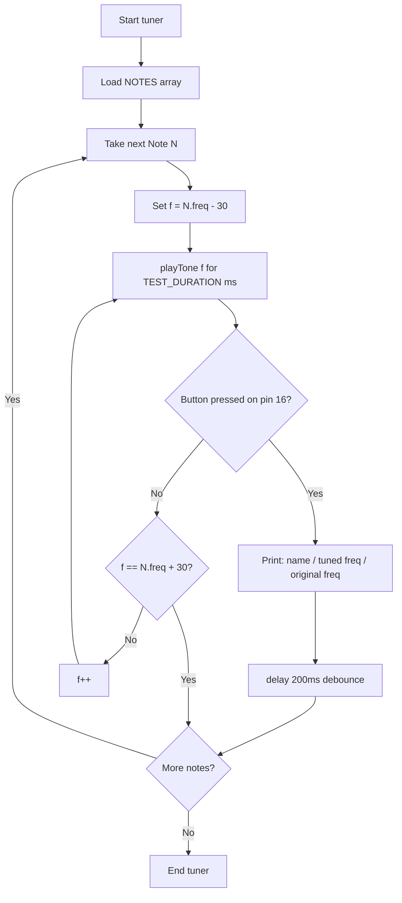

# Buzzer ESP32 — Data Structure Architecture Design

## Overview

This document defines the recommended data structures, code organization, and workflow logic for the `buzzer.ino` tuning utility and song playback system running on an ESP32 with the `BuzzerESP32` library. All design decisions are constrained by Arduino/ESP32 embedded realities: no STL, limited SRAM (~320 KB on ESP32, but shared with WiFi/BT stack), and a custom frequency scale used by `BuzzerESP32` that is **not** standard Hertz.

---

## 1. Data Structure Recommendation

### Problem with the Current Approach

| Issue | Current Code | Recommended Fix |
|---|---|---|
| Heap allocation | `String name` in `Note` class | `const char*` — stored in flash literal pool |
| `struct BNLength` instance fields | Default-value instance fields cost RAM per instance | `#define` or `static const int` |
| `struct BNNote` fields empty | No values assigned | Replace with a `const` array of `Note` structs |
| `BuzzerNotesClass` with `octave` field | Unclear purpose, unused | Remove or redesign as a lookup helper |

### Chosen Constructs

- **`struct Note`** — Plain data holder (name + frequency). No heap, no vtable. Suitable for placing in `const` global arrays.
- **`const Note[]` array** — Global, fixed-size, stored in flash (`.rodata`). Iterable for tuning; searchable by index for song playback.
- **`#define` constants** — For note lengths. Zero RAM cost, evaluated at compile time.
- **`struct SongStep`** — Pairs a frequency value with a duration. An array of these represents a song.
- **No `class` with state** — Avoid class instances that duplicate data already expressed in the note array. A lightweight namespace-style header is preferred.

### Why Not STL?

`std::vector`, `std::map`, and `std::string` are not reliably available on Arduino-targeted ESP32 boards without extra configuration. Even where available, dynamic allocation on embedded systems risks heap fragmentation. Fixed-size arrays are deterministic and safe.

### Why Not `PROGMEM`?

`PROGMEM` is an AVR (ATmega) attribute. On the ESP32 (Xtensa LX6), `const` global variables are already placed in flash by the compiler — no `PROGMEM` macro is needed. Using `const Note notes[]` at file scope is sufficient and portable.

---

## 2. Note Representation

### The Frequency Scale

The `BuzzerESP32` library does **not** use standard Hz (e.g., standard C5 = 523 Hz). The existing code uses a shifted/scaled value where C5 ≈ 532. The tuner's purpose is to determine the correct value for **this specific buzzer hardware**. Therefore:

- Frequencies stored in the note array are **approximate starting points**, not calibrated values.
- The tuner sweeps `freq - 30` to `freq + 30` so the operator can press a button when the tone sounds correct and capture the calibrated value.

### Struct Definition

```cpp
// In buzzer_notes.h
struct Note {
    const char* name;  // e.g. "C5" — pointer to string literal in flash
    int freq;          // approximate BuzzerESP32 frequency unit, NOT standard Hz
};
```

**`const char*` vs `String`:**  
`String` allocates on the heap via `malloc`. Each `new String("C5")` is a separate heap object, fragmenting the 512-byte Arduino heap rapidly. `const char*` pointing to a string literal costs zero heap — the string lives in the flash literal pool. It is read-only, which is appropriate since note names never change.

---

## 3. Note Collection

### Range

Natural notes from **B3 through C6** = 16 notes. Chromatic (including sharps/flats) = 27 notes. Design supports natural notes initially; the array can be extended.

Natural notes: `B3 C4 D4 E4 F4 G4 A4 B4 C5 D5 E5 F5 G5 A5 B5 C6`

### Declaration (in `buzzer_notes.h`)

```cpp
const Note NOTES[] = {
    {"B3", 147},
    {"C4", 202},
    {"D4", 257},
    {"E4", 532},   // needs tuner calibration — currently suspect (same as C5)
    {"F4", 312},
    {"G4", 367},
    {"A4", 422},
    {"B4", 477},
    {"C5", 532},   // middle C equivalent in BuzzerESP32 scale
    {"D5", 587},
    {"E5", 642},
    {"F5", 697},
    {"G5", 752},
    {"A5", 807},
    {"B5", 862},
    {"C6", 917},
};

#define NOTES_COUNT (sizeof(NOTES) / sizeof(NOTES[0]))
```

> **Note:** The existing code shows `E4 = 532`, which is identical to `C5 = 532`. This is almost certainly a data entry error. The tuner is designed to surface and correct exactly these kinds of errors.

### Access Patterns

**For tuning** — iterate by index:
```cpp
for (int i = 0; i < NOTES_COUNT; i++) { /* sweep NOTES[i].freq ± 30 */ }
```

**For song playback** — reference by index constant:
```cpp
#define IDX_C5  8   // index of C5 in NOTES[]
buzzer.playTone(NOTES[IDX_C5].freq, quarter);
```

Or define frequency aliases post-tuning as `#define C5 532` (the current approach in the commented-out section), which is also valid and zero-cost.

---

## 4. Note Length Representation

### Recommendation: `#define` Constants

```cpp
// In buzzer_notes.h
#define LEN_SIXTEENTH  75
#define LEN_EIGHTH    150
#define LEN_QUARTER   300
#define LEN_HALF      600
#define LEN_WHOLE    1200
```

**Why not `struct BNLength`?**  
`struct BNLength` with default instance fields requires an instantiation (e.g., `BNLength len;`) which consumes 5 × `sizeof(int)` = 10 bytes of RAM per instance. More importantly, the intent is constants — `#define` or `static const int` communicates that intent clearly and costs nothing at runtime.

**Alternative — `namespace`-style `const int`** (slightly more type-safe than `#define`):
```cpp
namespace Len {
    static const int sixteenth = 75;
    static const int eighth    = 150;
    static const int quarter   = 300;
    static const int half      = 600;
    static const int whole     = 1200;
}
// Usage: buzzer.playTone(freq, Len::quarter);
```

Either approach is acceptable; `#define` is simpler for a utility sketch.

---

## 5. Song Representation

### Struct Definition

```cpp
// In buzzer_notes.h
struct SongStep {
    int freq;      // BuzzerESP32 frequency; use 0 for a rest
    int duration;  // milliseconds (use LEN_* constants)
};
```

### Defining a Song

A song is a `const` array of `SongStep` terminated naturally by its length (use `ARRAY_LENGTH` macro):

```cpp
// Example: Ode to Joy fragment
const SongStep ODE_TO_JOY[] = {
    {532, LEN_QUARTER},   // C5
    {532, LEN_QUARTER},   // C5
    {587, LEN_QUARTER},   // D5
    {642, LEN_QUARTER},   // E5
    {642, LEN_QUARTER},   // E5
    {587, LEN_QUARTER},   // D5
    {532, LEN_QUARTER},   // C5
    {477, LEN_QUARTER},   // B4
    {  0, LEN_QUARTER},   // rest — freq=0, use delay()
    // ...
};
#define ODE_TO_JOY_LEN (sizeof(ODE_TO_JOY) / sizeof(ODE_TO_JOY[0]))
```

### Playback Function

```cpp
void playSong(const SongStep* song, int len) {
    for (int i = 0; i < len; i++) {
        if (song[i].freq == 0) {
            delay(song[i].duration);       // rest = silence
        } else {
            buzzer.playTone(song[i].freq, song[i].duration);
        }
    }
}
```

### Rest Representation

A rest is a `SongStep` with `freq = 0`. The playback function checks for zero and calls `delay()` instead of `playTone()`. This mirrors the existing pattern `delay(quarter); // rest` seen in `ode_to_joy()`.

---

## 6. Tuner Workflow

### Hardware

- Buzzer: GPIO **25**
- Button: GPIO **16** (active-low with internal pull-up, or external pull-down — design uses polling)

### Button Strategy: Polling vs. Interrupt

**Polling is recommended** for this use case because:
- The frequency sweep loop is short (100 ms per step × 61 steps = ~6 seconds per note)
- The button press must correlate with the currently-playing frequency — an interrupt that fires and stores the frequency is equivalent to polling within the same tight loop
- Interrupt-based debouncing adds complexity without benefit here

### Logic Sketch

```
setup:
    pinMode(BUTTON_PIN, INPUT_PULLUP)   // pin 16, LOW = pressed
    Serial.begin(9600)
    buzzer.setTimbre(30)

tuner():
    for each note N in NOTES[]:
        sweep f from (N.freq - 30) to (N.freq + 30):
            buzzer.playTone(f, TEST_DURATION)
            if digitalRead(BUTTON_PIN) == LOW:
                Serial.print("CALIBRATED | Note: ")
                Serial.print(N.name)
                Serial.print(" | Tuned Freq: ")
                Serial.print(f)
                Serial.print(" | Original Approx: ")
                Serial.println(N.freq)
                delay(DEBOUNCE_MS)         // ~200ms debounce
                // optionally: skip to next note
                break
```

### Debounce

After a button press is detected, `delay(200)` prevents multiple captures from a single physical press. No hardware debounce circuit is required for this low-stakes use case.

### Tuner Mode Flow Diagram



---

## 7. File and Code Organization

### Recommended Structure

```
utilities/buzzer/
├── buzzer.ino          — main sketch: setup(), loop(), tuner(), playSong()
└── buzzer_notes.h      — all note/length/song data definitions
```

### `buzzer_notes.h` Contains

- `struct Note` definition
- `const Note NOTES[]` array (B3–C6)
- `#define LEN_*` note length constants
- `struct SongStep` definition
- `const SongStep ODE_TO_JOY[]` and other songs
- `#define ARRAY_LENGTH(a)` macro (or move to main sketch)
- `#define IDX_*` index aliases for named note access (optional)
- Post-calibration `#define` frequency aliases (e.g., `#define C5 532`)

### `buzzer.ino` Contains

- `#include <BuzzerESP32.h>`
- `#include "buzzer_notes.h"`
- `BuzzerESP32 buzzer(25)`
- `void tuner()` — tuner loop
- `void playSong(const SongStep*, int)` — generic playback
- `void setup()` — calls `tuner()` or `playSong()`
- `void loop()` — empty or button-polling for mode switching

### Why a `.h` File, Not a Class?

The note data is **static, read-only configuration** — not behavior that needs encapsulation. A header of `const` arrays and `#define`s is simpler, cheaper, and idiomatic for Arduino sketches. The `BuzzerNotesClass` in the current code adds indirection without benefit. If future refactoring moves toward a library, a class wrapper can be added at that point.

---

## Summary of Key Decisions

| Decision | Choice | Rationale |
|---|---|---|
| Note name storage | `const char*` | Zero heap, flash literal pool, read-only |
| Note collection | `const Note[]` global array | Iterable, deterministic, no dynamic allocation |
| Frequencies | Approximate starting values | Tuner workflow calibrates them per-hardware |
| Note lengths | `#define` constants | Zero RAM, compile-time, matches existing pattern |
| Song representation | `const SongStep[]` array | Fixed-size, portable, supports rest via freq=0 |
| Rest in song | `freq = 0` in `SongStep` | Clean sentinel value, handled in playback function |
| Button (tuner) | Polling `digitalRead` on pin 16 | Simple, sufficient, no debounce complexity |
| File split | `buzzer.ino` + `buzzer_notes.h` | Separates data from logic cleanly |
| No STL containers | Confirmed — use plain arrays | No STL guarantee on Arduino ESP32 target |
